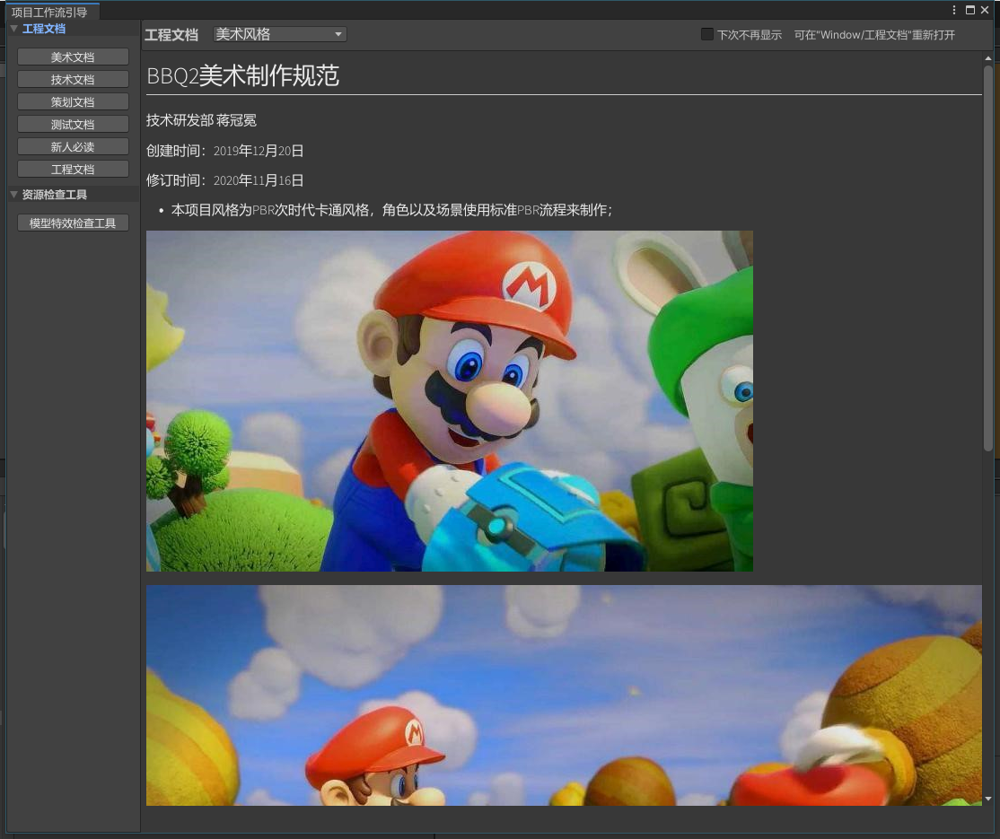

# Unity Markdown解析工具

### 使用[UnityMarkdownViewers](https://github.com/gwaredd/UnityMarkdownViewers)在Unity内解析Markdown


&nbsp;
## 使用方法
1. 文档查看: 将该工具放入Editor文件夹以后Unity内会跳出文档弹窗，也可以在Unity中选择**Window->项目工作流引导**打开。点击md文件可以在Inspector内查看md文档。


2. 文档增加/删除: 加入工具运行一次Unity之后会在```Assets/~Config/Docs/```目录创建一些文档模板, 可模仿模板继续创建一些文件夹如：```1.美术文档, 2.技术文档```，然后在创建的文件夹内放入md文档，命名为```1.xxx.md, 2.xxx.md```。工具会自动读取文件夹名和文档名。


3. 资源检查：模型特效检查工具用于搜索工程内超过规定面数阈值的模型或者超过粒子数阈值的特效，也可检查特效所带贴图大小。