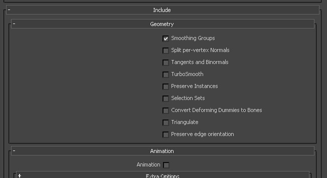

# 模型规范
+	模型的制作使用基本的流程制作，使用MAX、Maya、Blender等工具对产出资源差异不大，但针对不同的平台，我们大致定了一些基本的制作标准  
**请查看"Assets\~Config\Docs\模型规范.xlsx"**

1.	没有特定要求下，必须以物体对象中心为轴心， 单位设置cm
2.	材质的ID和物体的ID号必须一致
3.	模型面必须保持4边以内
4.	路径、贴图、模型命名非中文
5.	如模型名为hero 材质球名为 mar_hero 贴图名：hero_D 动画命名：hero@run01
6.	保持整个模型干净，布线均匀
7.	把模型重心点放置在合适的位置
8.	骨骼搭建要分体形，尽量一个种族一套体形，不要分很多体形制作
+	导出模型规范：

+	动画导出规范：

11.	场景模型尽量用垒积木的方式制作，少用挤压等操作
12.	角色、模型贴图格式：tga or png
13.	动画帧数 30 帧每秒
14.	场景模型导出时，保持场景干净，无虚拟体摄像机等
15.	如使用默认骨骼搭建，做好骨骼命名规范
16.	把子模型合并成一个
 