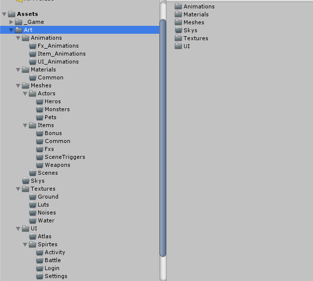
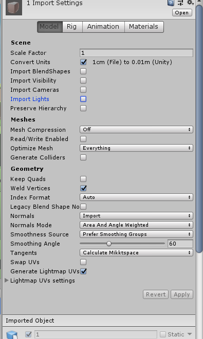
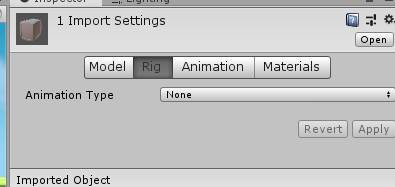
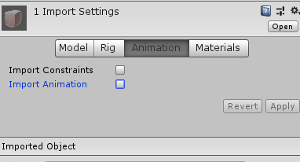
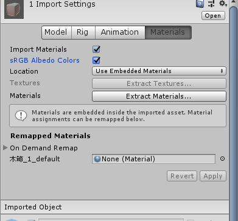

# 导入规范

### Assets下资源目录：

### 模型导入引擎后，场景模型的设置：

### Model Tab页：

### Rig Tab页：

### Animation Tab页：场景不需要Animation

### Materials Tab页：场景不需要Animation

###	角色换装和换肤系统Tips:

本项目后期角色需要做换装换肤的收费点，所以换装需要做预先的部件拆分，首先骨骼这边需要做预先的准备：
+	角色骨骼，除了cs之外，需要包含要换装挂载的部件的骨骼，比如肩甲的骨骼，或者翅膀的挂点
+	硬武器之类的直接挂载到目标骨骼上
+	类似胸甲之类的直接用公用骨骼的方式来实现，这些模型也需要包含跟目标角色一致的骨骼结构
+	翅膀之类的也是直接挂载挂点
