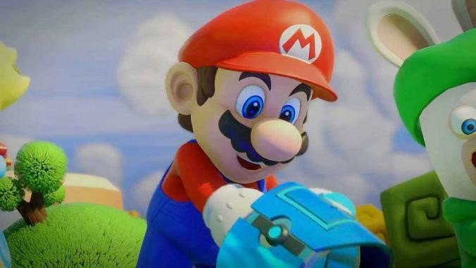
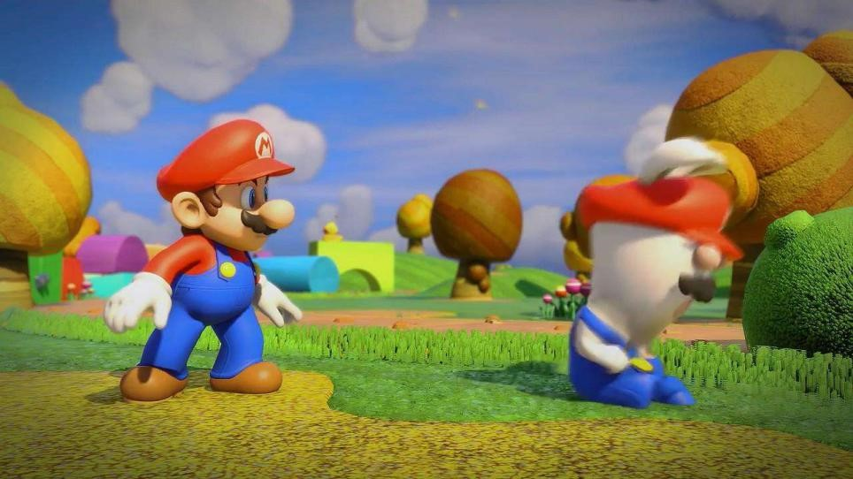
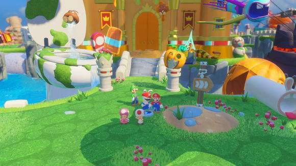

# BBQ2美术制作规范 
技术研发部 蒋冠冕

创建时间：2019年12月20日

修订时间：2020年11月16日

+ 本项目风格为PBR次时代卡通风格，角色以及场景使用标准PBR流程来制作；

+	因为项目需要多平台发布，包括主机XBOX、PS4、Switch以及手机端，因此我们需要针对不同的平台  
做不同的优化和定制，特别是美术这边的制作流程更加需要规范；

+	我们这边把该美术风格定义为PBR卡渲，用通俗的说法就是手办风，材质需要包含基本的Albedo、Normal、  
Metalic、Roughness、AO等信息，这套流程走的是标准物理渲染的流程，可以精准的去表达材质的属性和质感，以及能跟环境GI交互；

+	项目的风格对标《马里奥疯狂兔》，PRB卡渲的光影参考对标《守望先锋》  
、《阴阳师平安京》、《植物大战僵尸：花园战争》这几款产品;

