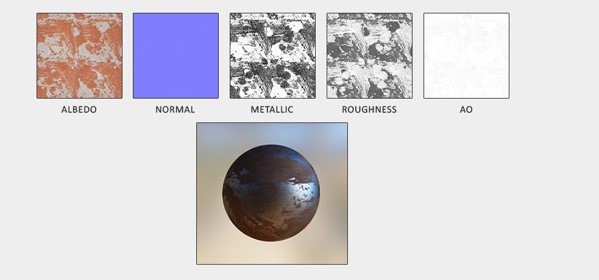
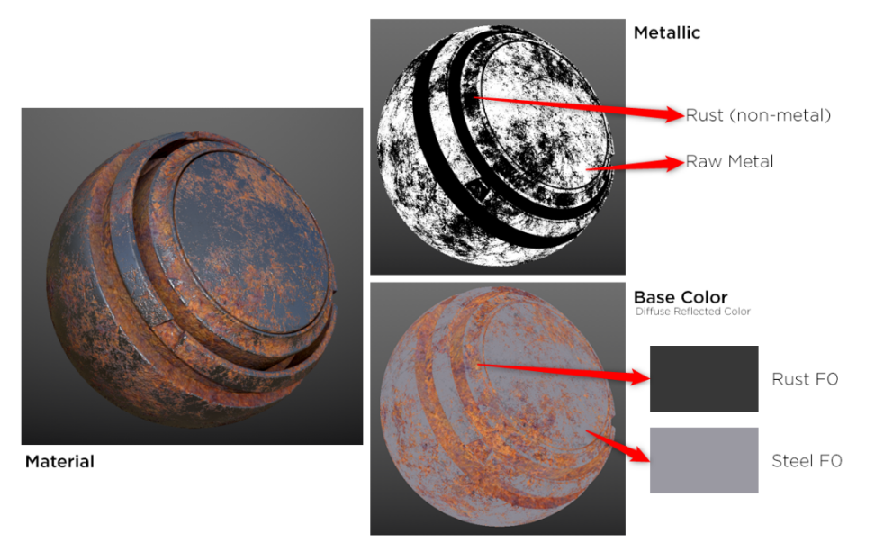

# BBQ2贴图规范 
+	模型材质球制作的需要走标准PBR的流程，需要符合PBR的规范，产出工具建议使用Substsance Painter或者Substance Designer；我们基本使用Metallic工作流，导出的按照Albedo + Metallic + Normal的方式来导出，需要在Substance里面指认导出选项，Normal需要指认为OpenGL空间(区别于UE4)；

+	PBR贴图制作需要符合物理规范，尽可能使用Material Library中的真实物理材质，如果成本可以的话，法线信息尽可能用高模去bake；对于金属流来说，Albedo贴图里面不应该有任何光影的信息，包括AO，  
光照等，贴图的金属区域的F0应该在70~100%，非金属则在2~5%：

+	贴图的颜色空间，我们在主机上使用的是LinearSpace,在移动设备上使用的是GammaSpace, PS配置线性空间的流程可以阅读[Unity色彩空间之线性空间(Linear Space)UI制作规范](https://apistudio.om.dianhun.cn/view/doc/17708642)

